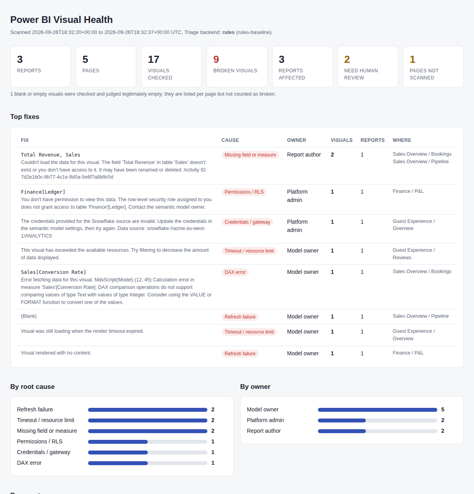

# pbi-visual-doctor

Find the broken visuals in your published Power BI reports, work out why they broke, and get one health report for every dashboard, without paying a vision LLM to look at hundreds of screenshots.

```
50 dashboards x 5 pages  ->  Playwright reads every visual as text
                         ->  only the broken or suspicious ones go to Jev or Laya
                         ->  typed answers: root cause, owner, severity, "really broken?"
                         ->  one HTML report: top fixes, by report, by page
```



## Why

Checking published reports page by page is slow, and sending screenshots of every page to a model like GPT or Claude gets expensive fast. Most of that work does not need a model at all: a broken visual leaves text behind, such as "Can't display this visual", "The field 'Total Revenue' doesn't exist" or "(Blank)".

So pbi-visual-doctor splits the job:

| Step | Done by | Cost |
| --- | --- | --- |
| Open every page and read every visual | Playwright (headless Chromium) | free |
| Decide which visuals look wrong | Rules on the extracted text | free |
| Decide *why* each one is wrong, who owns the fix, how bad it is, and whether a blank visual is really broken | [Jev](https://typesafe.ai/blog/introducing-system-one-models-and-jev) or [Laya](https://github.com/NandhaKishorM/laya) typed decisions | Jev: fractions of a cent for a whole workspace. Laya: free, runs locally |
| Group identical failures into "top fixes" and write the report | Code | free |

Jev and Laya are "System One" models: they do not generate text, they answer typed questions (pick one of these options, give a score on this scale, yes or no) in a single pass. That is exactly the shape of a triage decision, and it makes them fast and cheap enough to run on every visual in every report.

## What it finds

- Visuals showing an error ("Can't display this visual", "Something's wrong with one or more fields", resource limits, and so on), including the full message behind **See details**
- Visuals stuck loading after a timeout
- Blank visuals: a KPI card showing "(Blank)", a chart that drew nothing, a table with "No data". The model decides whether each one is broken or just legitimately empty for the current filters
- Pages that fail to load at all

For each problem visual you get:

- **Root cause**: missing field or measure, DAX error, relationship issue, permissions or RLS, credentials or gateway, refresh failure, timeout or resource limit, custom visual, not broken, other
- **Owner**: report author, semantic model owner, or platform admin
- **Severity**: cosmetic, partial, unusable visual, critical
- **Confidence**, so low-confidence items are flagged for human review

Identical failures are grouped. If a measure is renamed and breaks 23 visuals across 8 reports, you see one fix with 23 visuals against it, not 23 separate rows.

## Quick start

```bash
git clone https://github.com/riishabhz/pbi-visual-doctor
cd pbi-visual-doctor
python -m venv .venv && source .venv/bin/activate   # Windows: .venv\Scripts\activate
pip install -e .
playwright install chromium

pbi-doctor demo
```

The demo crawls a few bundled pages that imitate Power BI's markup (a renamed measure used on two pages, a DAX type error, expired Snowflake credentials, an RLS block, a visual that never finishes loading, blank cards, and a missing page). It uses the offline `rules` backend, so it needs no account or API key. Open `pbi-doctor-demo/report.html` to see the result.

## Scanning your own reports

For a step-by-step walkthrough, including Laya setup and tuning, see the [user guide](docs/USER-GUIDE.md).

```bash
pbi-doctor login     # sign in once; the browser closes by itself when you are done
pbi-doctor scan      # scans every report in every workspace you can access
```

`login` opens a browser window. Sign in to Power BI (MFA included); once the home page loads, the session is saved to `.auth/state.json` and the window closes. Sessions expire. If a scan reports "Redirected to sign-in" or asks you to sign in again, run `pbi-doctor login` again.

To scan less than everything:

```bash
pbi-doctor scan --workspace "Sales"            # one workspace (name, part of the name, or id)
pbi-doctor scan --report "Pipeline"            # reports whose name contains this text
pbi-doctor scan --url "https://app.powerbi.com/groups/<workspace-id>/reports/<report-id>"
pbi-doctor scan --list                         # print what would be scanned, then exit
pbi-doctor scan --headed                       # show the browser while scanning
```

`--workspace`, `--report` and `--url` can be repeated. `--include-my-workspace` adds reports from My workspace. Hidden pages (usually drill-through and tooltip pages) are skipped; `--include-hidden-pages` scans them too and labels them "hidden page" in the report. For a fixed, hand-maintained list, `--targets targets.yaml` still works (see `examples/targets.example.yaml`).

**How discovery works.** `scan` opens your saved session headless on the Power BI home page and reads the access token the web app already holds, then lists workspaces, reports and pages through the Power BI REST API. The token is kept in memory only and never written to disk (set `PBI_ACCESS_TOKEN` to supply your own instead). The visuals themselves are read in the browser session. `.auth/state.json` grants access to your account: **keep it private**. It is in `.gitignore`.

If `pbi-doctor` is not recognized (common with the Microsoft Store Python on Windows), use `python -m pbi_visual_doctor` instead, for example `python -m pbi_visual_doctor scan`.

### Choosing a triage backend

```bash
# Offline baseline, no model
pbi-doctor scan

# Jev (hosted by TypeSafe)
export TYPESAFE_API_KEY=...
pbi-doctor scan --backend jev

# Laya, running locally in-process
pip install -e ".[laya]"
pbi-doctor scan --backend laya
```

Each scan gets its own folder named after the time and backend, for example `pbi-doctor-report/2026-09-26_21-38-05_laya/`, so earlier results are kept. Pass `--out <folder>` to choose the folder yourself. Each folder contains:

| File | What it is |
| --- | --- |
| `report.html` | The health report: totals, top fixes, root causes, owners, and every problem visual by report and page, with a filter box |
| `findings.json` | Every triaged visual with its answers, confidence and fingerprint |
| `findings.csv` | The same, flat, ready to load into Power BI itself |
| `scan.json` | The raw crawl. Re-triage it without crawling again: `pbi-doctor triage --input pbi-doctor-report/<run>/scan.json --backend laya` (writes a new `..._laya_triage` folder) |

`pbi-doctor triage` is also the cheap way to compare backends on the same scan.

## Backends

| Backend | `--backend` | Needs | Notes |
| --- | --- | --- | --- |
| Rules | `rules` | nothing | Keyword baseline so you can try the tool offline. Not a model; do not rely on it for decisions. |
| Jev | `jev` | `TYPESAFE_API_KEY` | Strongest zero-shot. Hosted in the US; error text leaves your machine. Pinned to `jev-1.13.0` by default (`--model` or `JEV_MODEL` to change) so results are repeatable. |
| Laya, local | `laya` | `pip install -e ".[laya]"` | Open weights (Apache 2.0), runs on your CPU or GPU, nothing leaves your machine. Weaker zero-shot than Jev; fine-tuning on your own labelled errors is where it gets good. Uses the English checkpoint by default because Power BI error messages are English (`--model multilingual` to change). |
| Laya, server | `laya-http` | a running `laya-serve` | Same as above behind Laya's Jev-compatible HTTP server. `LAYA_BASE_URL` (default `http://localhost:8000`), optional `LAYA_API_KEY`. |

Jev and laya-serve use the same `POST /v1/systemone` request format, so the same code talks to both.

**What gets sent to the model.** Only text about problem visuals: report and page name, visual title and type, status, the on-canvas error message and the "See details" text (truncated to 1,500 characters). Healthy visuals and their data are never sent. Error details can still contain table, column and data source names, so check that against your data policy before using a hosted backend.

The questions asked are defined in `src/pbi_visual_doctor/triage.py`. Edit the categories or owners there to match how your team works.

## Configuration

Power BI's page structure is not a documented API and changes from time to time. Every selector, error phrase and timing the crawler uses lives in `src/pbi_visual_doctor/defaults.yaml`. To adapt, copy the parts you need into your own file and pass it with `--config`:

```yaml
# my-config.yaml
selectors:
  visual_container: ["visual-container", ".visual-container"]
phrases:
  error: ["Can't display this visual", "Something went wrong", "Your custom message"]
timing:
  render_max_wait_ms: 60000
  concurrency: 4
triage:
  review_threshold: 0.7
```

If a scan finds no visuals on pages that clearly have them, the selectors are the first thing to check: run with `--headed`, open the browser dev tools on a visual, and update `visual_container`.

**Speed.** Each page takes roughly the time Power BI needs to render it plus `render_settle_ms`. With the default concurrency of 3, 250 pages is in the region of 20 to 30 minutes. Raise `--concurrency` if your capacity copes.

## Running it on a schedule

`--fail-on-broken` makes the command exit with code 1 when anything is broken or a page could not be scanned, so it fits in CI. `.github/workflows/tests.yml` runs the test suite; `examples/scheduled-scan.yml` is a starting point for a nightly scan. For unattended scans, a saved browser session will expire; a service account without MFA, or Power BI Embedded with a service principal, is more robust.

## Limits

- **It only sees what fails visibly.** A visual that renders the wrong number without any error is not detected.
- **Answers are predictions.** Root cause and owner come from the error text; treat them as a strong first guess, and check the items marked for review.
- **Selectors can break** when Microsoft changes the Power BI front end. They are in one config file for that reason.
- **Blank does not mean broken.** A card showing "(Blank)" may be correct for the current filters. That is exactly the call the `is_broken` question makes, but it can be wrong in both directions.
- **Laya's yes/no answers** on its English checkpoint are sensitive to wording (see the Laya README). Validate on your own reports before trusting its blank-visual verdicts.
- Reports are scanned with their default filters and bookmarks. Visuals that only break under specific slicer selections are not exercised.

## Development

```bash
pip install -e ".[dev]"
playwright install chromium
pytest
```

The end-to-end test crawls the bundled demo pages with a real browser.

Project layout:

```
src/pbi_visual_doctor/
  cli.py          commands: login, scan, triage, demo
  crawler.py      Playwright crawl, visual text extraction, See details capture
  detect.py       rule-based status: ok, error, blank, timeout
  discovery.py    workspace, report and page listing via the Power BI REST API
  triage.py       the typed questions, answer parsing, fix grouping
  backends.py     Jev, Laya (local and HTTP), rules
  report.py       aggregation and HTML, JSON, CSV output
  defaults.yaml   selectors, phrases, timings
  demo/           fake Power BI pages for the demo and tests
```

Contributions are welcome, especially selector updates when the Power BI front end changes, and new error phrases.

## License

MIT. Jev is a product of TypeSafe AI; Laya is by Convai Innovations under Apache 2.0. This project is not affiliated with either, or with Microsoft.
